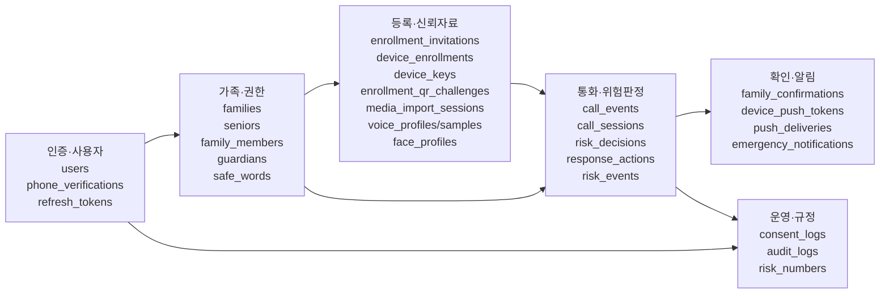
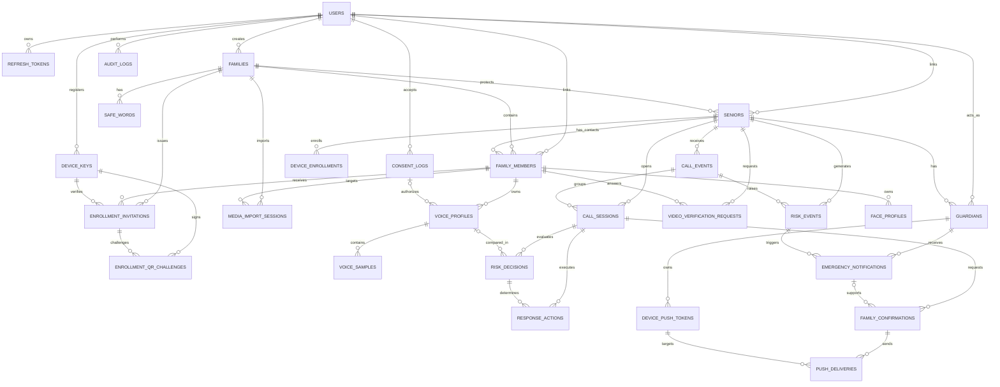
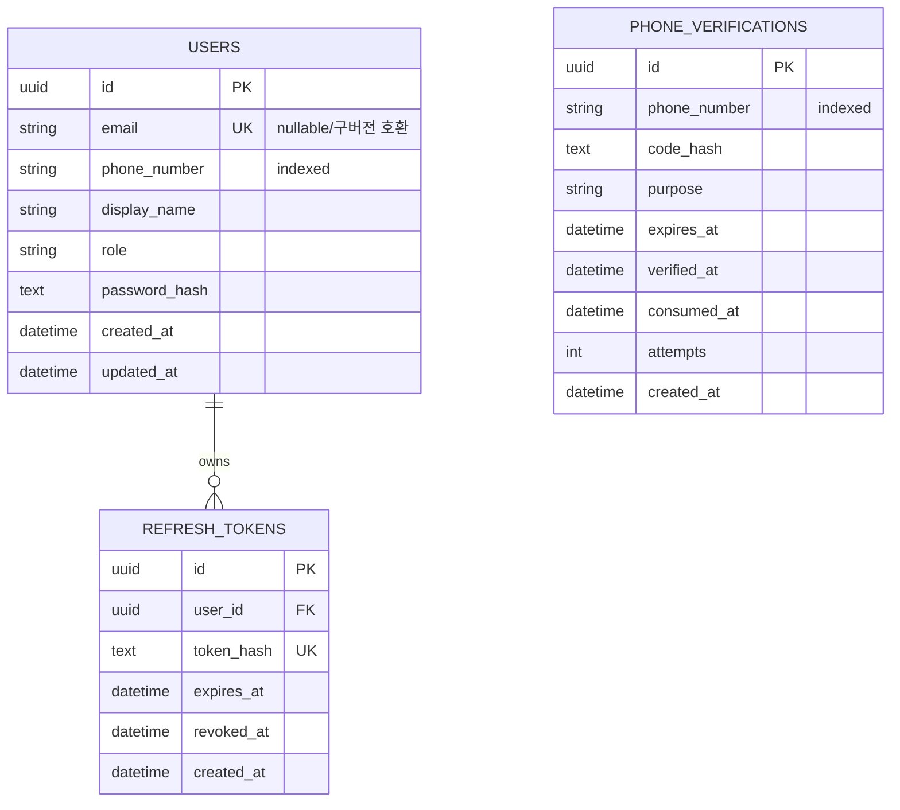
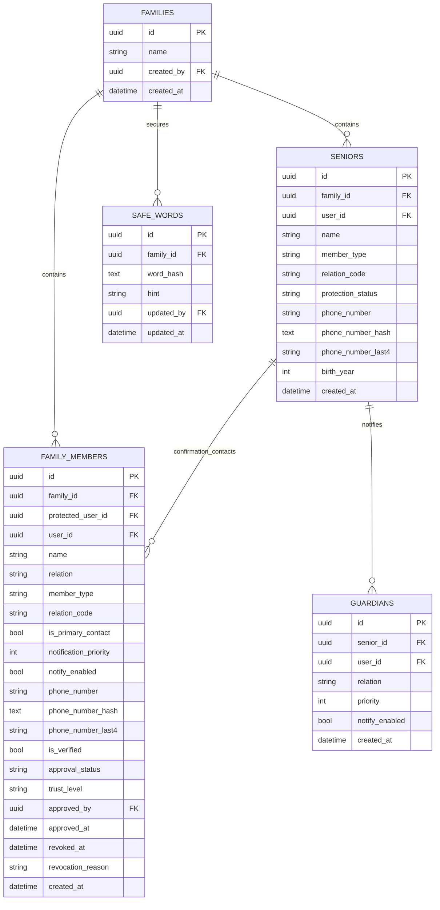
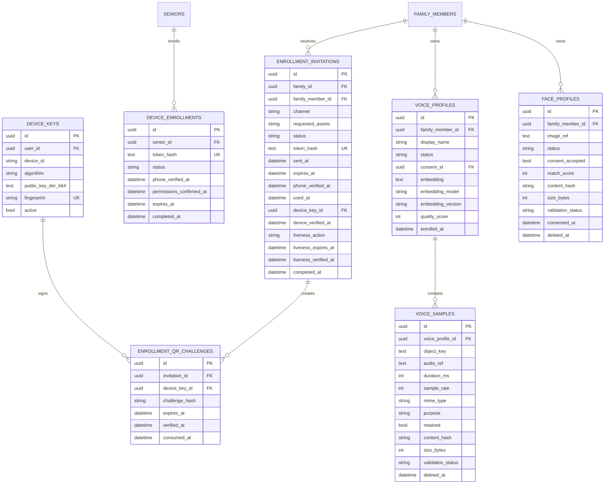
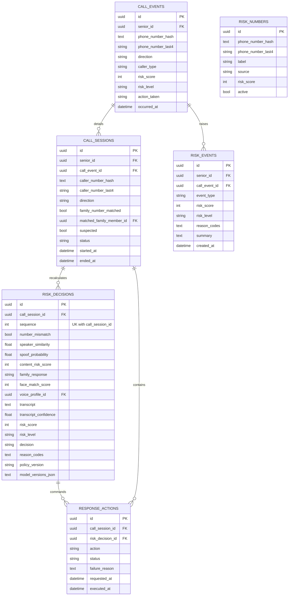
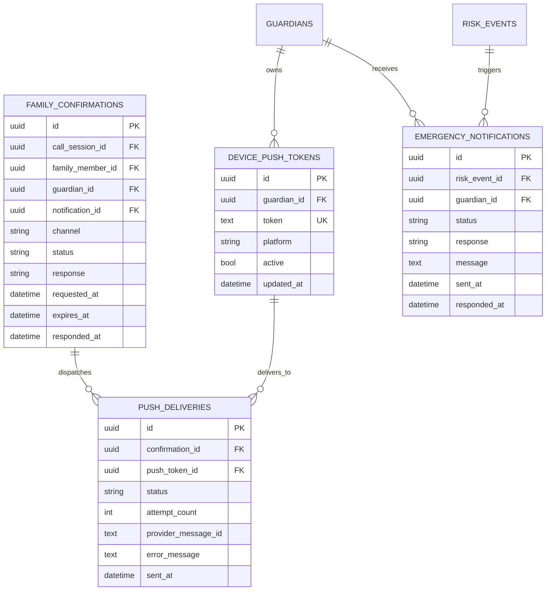
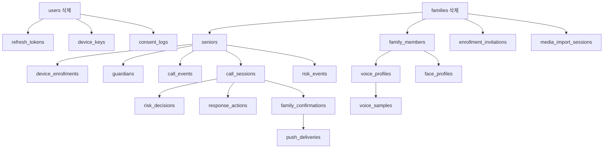

# SoriCall 현행 DB 레이아웃

- 작성 기준일: 2026-07-19
- 기준 소스: `services/api/app/models.py`, `services/api/alembic/versions/`
- 기본 키: UUID
- 운영 DB: PostgreSQL 호환
- 개발·테스트 DB: SQLite 호환 `GUID` 타입

## 1. 전체 논리 구조

## 2. 핵심 ERD

## 3. 테이블 목록

| 도메인 | 테이블 | 역할 |
|---|---|---|
| 인증 | `users` | 사용자 계정과 역할 |
| 인증 | `phone_verifications` | 휴대전화 OTP 요청·검증·소비 상태 |
| 인증 | `refresh_tokens` | 회전형 로그인 갱신 토큰 |
| 가족 | `families` | 데이터 접근의 가족 경계 |
| 가족 | `seniors` | 통화 보호 대상 |
| 가족 | `family_members` | 확인 가족 및 가족 전화번호 |
| 가족 | `guardians` | 보호자·알림 수신자 연결 |
| 가족 | `safe_words` | 가족 안전문구 해시 |
| 등록 | `enrollment_invitations` | 링크·QR·직접 등록 초대 |
| 등록 | `device_enrollments` | 보호 대상 Android 기기 등록 |
| 등록 | `device_keys` | QR 서명 검증용 공개키 |
| 등록 | `enrollment_qr_challenges` | 단기 QR challenge |
| 등록 | `media_import_sessions` | 외부 음성·영상 자료 반입 |
| 생체 | `voice_profiles` | 가족 음성 임베딩 프로필 |
| 생체 | `voice_samples` | 음성 샘플 검증 메타데이터 |
| 생체 | `face_profiles` | 얼굴 참조와 검증 결과 |
| 생체 | `video_verification_requests` | 통화 중 영상 확인 요청 |
| 통화 | `call_events` | 기존 통화 이벤트 요약 |
| 통화 | `call_sessions` | 특허 흐름 단위 통화 세션 |
| 판정 | `risk_decisions` | 순차 위험 분석 결과 |
| 판정 | `response_actions` | 판정별 대응 명령과 실행 결과 |
| 판정 | `risk_numbers` | 위험 전화번호 해시 목록 |
| 판정 | `risk_events` | 사용자에게 노출할 위험 사건 |
| 확인 | `family_confirmations` | 확인 가족에게 보낸 확인 요청 |
| 알림 | `device_push_tokens` | 보호자 기기 푸시 토큰 |
| 알림 | `push_deliveries` | 푸시 발송 시도와 결과 |
| 알림 | `emergency_notifications` | 위험 사건별 긴급 알림 |
| 규정 | `consent_logs` | 동의 종류·버전·수락 증적 |
| 운영 | `audit_logs` | 주요 변경 감사 기록 |

## 4. 인증·사용자 레이아웃

설계 포인트:

- 신규 UI의 로그인 식별자는 휴대전화 번호다.
- `users.email`은 nullable이며 현재 이메일 가입 화면에서는 사용하지 않는다.
- OTP 원문과 새로고침 토큰 원문은 저장하지 않고 해시를 저장한다.
- `verified_at`, `consumed_at`, `revoked_at`으로 재사용을 방지한다.

## 5. 가족·권한 레이아웃

`family_members.protected_user_id`로 확인 가족을 특정 보호 대상에 종속시킨다. 동일 가족 그룹 안에서도 보호 대상별 확인 가족 목록과 승인 상태가 분리된다.

## 6. 등록·신뢰자료 레이아웃

## 7. 외부 자료 반입 레이아웃

`media_import_sessions`는 실제 미디어 바이너리보다 반입·검증·동의 상태를 관리한다.

| 컬럼군 | 컬럼 | 의미 |
|---|---|---|
| 대상 | `family_id`, `family_member_id` | 자료가 속할 가족과 인물 |
| 원본 정보 | `source`, `filename`, `declared_mime_type` | 사용자가 제공한 정보 |
| 서버 검증 | `detected_mime_type`, `content_hash`, `size_bytes` | 탐지·무결성 결과 |
| 상태 | `status`, `quality_status`, `failure_code` | 처리 단계와 실패 원인 |
| 신뢰 | `trust_level` | 외부 자료의 초기 신뢰 등급 |
| 증적 | `validated_at`, `phone_verified_at`, `consented_at` | 각 검증 단계 완료시각 |
| 보존 | `expires_at`, `purged_at` | 자동 폐기 기준과 결과 |

## 8. 통화·위험 판정 레이아웃

핵심 제약:

- `risk_decisions`는 `(call_session_id, sequence)` 복합 유일 제약을 갖는다.
- 최초 번호 판정과 이후 음성·내용·가족 응답 판정을 같은 세션에서 순차 보존한다.
- 전화번호 원문 대신 비교용 해시와 사용자 표시용 끝 4자리를 통화 테이블에 저장한다.
- `response_actions`는 요청 조치뿐 아니라 단말 실행 상태와 실패 원인까지 기록한다.

## 9. 가족 확인·알림 레이아웃

## 10. 삭제 및 보존 규칙

모델에 선언된 주요 `ON DELETE CASCADE` 흐름:

주의사항:

- 일부 FK는 `CASCADE`가 없으므로 사용자·위험 이벤트 등 상위 데이터 삭제 전에 참조 정리가 필요하다.
- 음성·얼굴은 `deleted_at`을 사용하는 논리 삭제 필드도 갖고 있다.
- 외부 반입 자료는 `expires_at`과 `purged_at`으로 만료·폐기 상태를 관리한다.
- 운영 보존기간과 개인정보 삭제 SLA는 DB 모델 외의 운영 정책으로 추가 확정해야 한다.

## 11. 인덱스 및 유일 제약

| 테이블 | 인덱스·제약 |
|---|---|
| `users` | `email` UNIQUE + INDEX, `phone_number` INDEX |
| `phone_verifications` | `phone_number` INDEX |
| `refresh_tokens` | `user_id` INDEX, `token_hash` UNIQUE + INDEX |
| `device_enrollments` | `senior_id` INDEX, `token_hash` UNIQUE + INDEX |
| `enrollment_invitations` | 가족·가족원 INDEX, `token_hash` UNIQUE + INDEX |
| `device_keys` | `user_id`, `device_id` INDEX, `fingerprint` UNIQUE + INDEX |
| `enrollment_qr_challenges` | 초대·기기키 INDEX |
| `media_import_sessions` | 가족·가족원·`content_hash` INDEX |
| `voice_samples`, `face_profiles` | `content_hash` INDEX |
| `call_sessions` | `caller_number_hash` INDEX |
| `risk_decisions` | `call_session_id` INDEX, 세션+순번 UNIQUE |
| `response_actions` | `call_session_id` INDEX |
| `family_confirmations` | `call_session_id` INDEX |
| `device_push_tokens` | `guardian_id` INDEX, `token` UNIQUE |
| `push_deliveries` | `confirmation_id` INDEX |
| `risk_numbers` | `phone_number_hash` INDEX |

## 12. 개인정보·보안 저장 원칙

| 데이터 | 현행 저장 방식 | 검토 사항 |
|---|---|---|
| 비밀번호 | 단방향 `password_hash` | 운영 해시 비용·알고리즘 점검 |
| OTP | `code_hash`, 만료·시도 횟수 | 발송 사업자 및 시도 제한 연동 |
| 토큰 | 초대·갱신 토큰 해시 | 원문 로그 출력 금지 |
| 전화번호 | 업무 테이블에는 원문과 해시가 혼재 | 원문 컬럼 암호화 또는 최소화 검토 |
| 안전문구 | `word_hash` | 힌트에 원문 포함 금지 |
| 음성 | 참조값·임베딩·검증 메타데이터 | 객체 저장소 암호화 및 수명주기 필요 |
| 얼굴 | 이미지 참조·검증 메타데이터 | 객체 저장소 삭제와 DB 논리 삭제 연계 |
| 통화 내용 | `risk_decisions.transcript` | 보존기간·마스킹·접근통제 필요 |
| 푸시 토큰 | 원문 토큰 | 암호화 저장과 폐기 정책 검토 |
| 감사정보 | 행위·대상·JSON 메타데이터 | 민감정보를 메타데이터에 넣지 않도록 제한 |

## 13. 물리 구현 시 권장 보완

1. `users.phone_number`에 정규화 기준을 적용한 유일 제약을 DB 수준에서도 명시한다.
2. `families.created_by`, `seniors.user_id`, `family_members.user_id` 등 권한 조회 FK에 인덱스를 추가한다.
3. `family_members`에 보호 대상·전화번호 해시 중복을 막는 업무 유일 제약을 검토한다.
4. `risk_numbers.phone_number_hash`는 활성 항목 기준 중복 방지 정책을 추가한다.
5. `reason_codes`, `requested_assets`, `model_versions_json`, `metadata_json`은 PostgreSQL 배열 또는 JSONB 전환을 검토한다.
6. `created_at`뿐 아니라 변경 가능한 핵심 테이블에 `updated_at`을 일관되게 둔다.
7. 생체·통화 내용·전화번호 원문 컬럼에 애플리케이션 또는 DB 암호화를 적용한다.
8. 파티셔닝 또는 보존 작업 대상은 `call_sessions`, `risk_decisions`, `audit_logs`, `push_deliveries` 순으로 검토한다.
