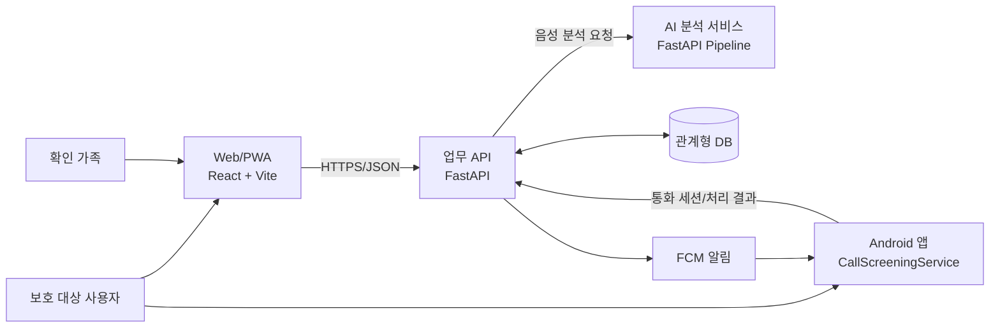
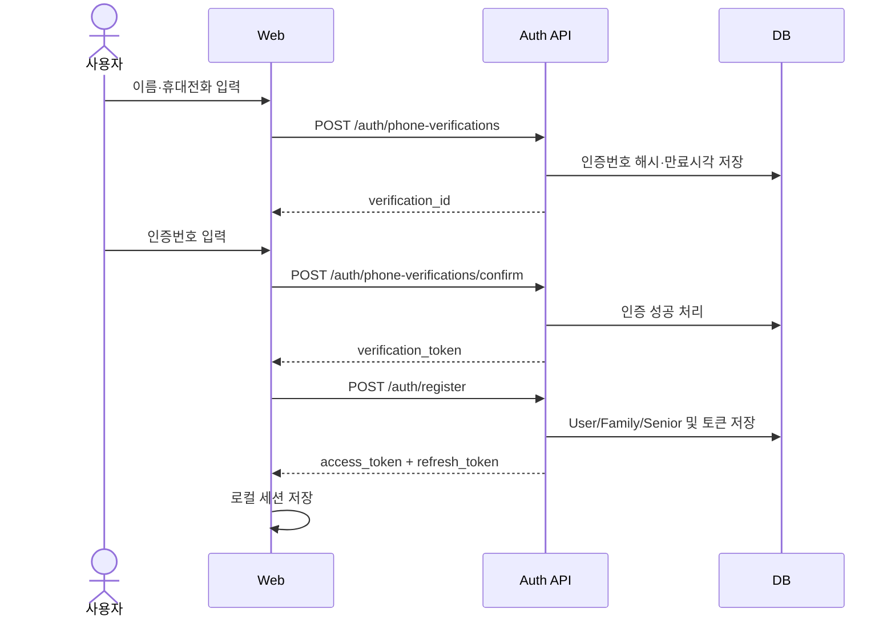
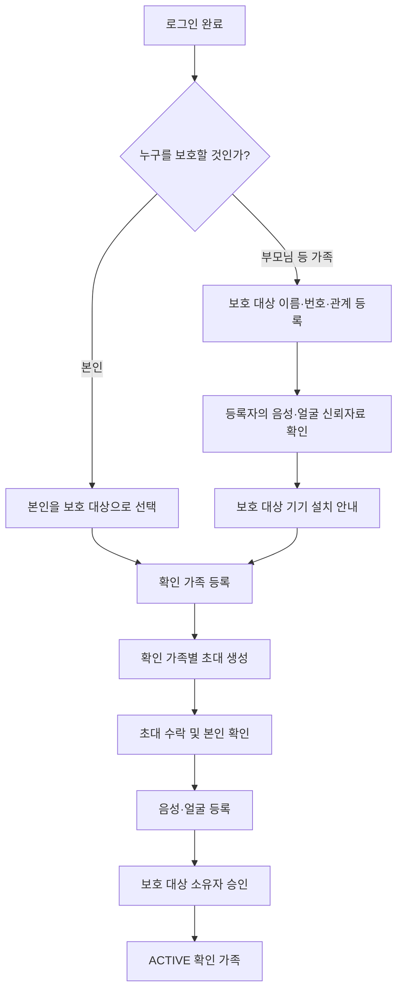
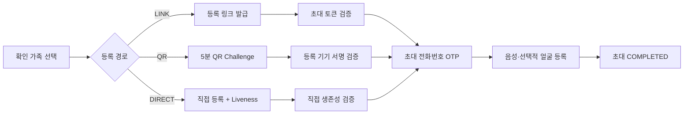
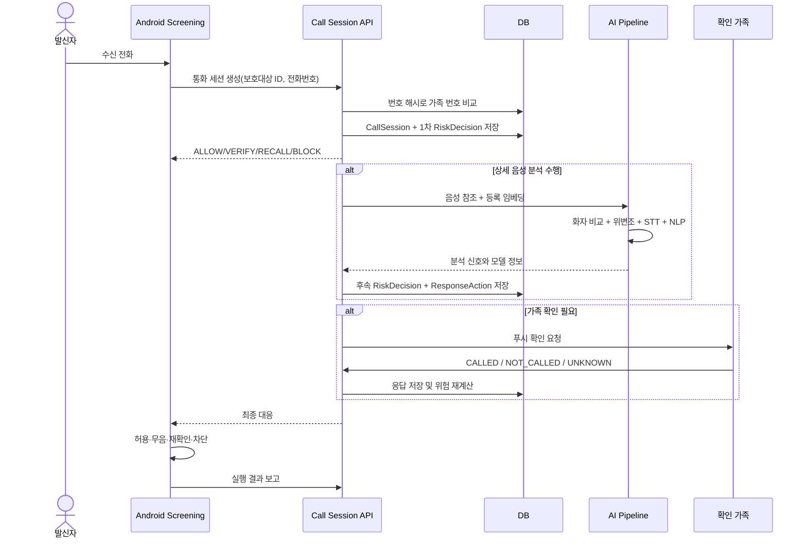
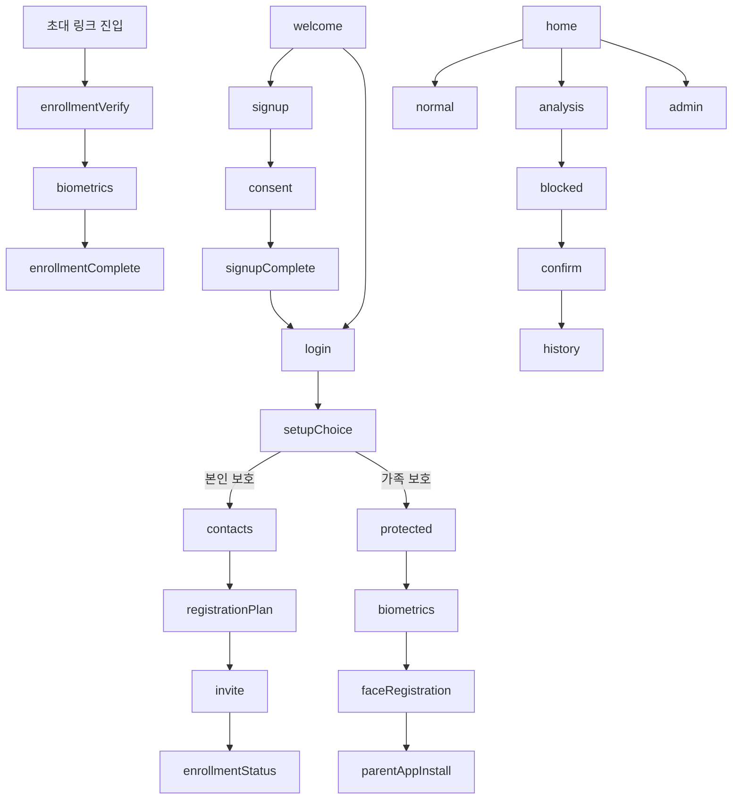
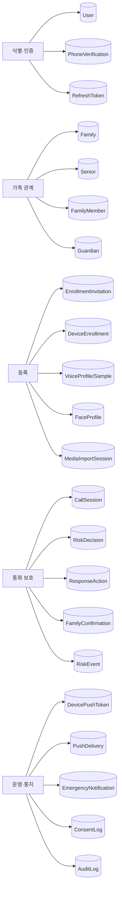

# SoriCall 현행 구현 프로세스 분해도

- 작성 기준일: 2026-07-19
- 기준: 현재 저장소의 Web, Android, API, AI 및 DB 구현 코드
- 목적: 개발된 기능을 업무 프로세스와 실행 컴포넌트 단위로 분해하고, 사용자 화면부터 데이터 저장까지의 연결 관계를 설명한다.

## 1. 시스템 경계

### 구현 컴포넌트

| 영역 | 주요 코드 | 책임 |
|---|---|---|
| Web/PWA | `apps/web/src/main.tsx`, `api.ts` | 가입, 가족 구성, 초대, 생체정보 등록, 현황 및 시연 화면 |
| Android | `SoriCallScreeningService.kt`, `SoriFirebaseMessagingService.kt` | 수신 전화 감지, 서버 판정 적용, 로컬 대체 판정, 경고 알림 |
| API | `services/api/app/api/v1/` | 인증, 가족, 등록, 통화, 위험 판정, 알림 API |
| 업무 서비스 | `services/api/app/services/` | 통화 세션, AI 연계, 위험 결정, 가족 확인, 알림 처리 |
| AI | `services/ai/app/` | 화자 비교, 위변조 탐지, STT, 위험 문구 분석 및 점수화 |
| DB | `services/api/app/models.py`, `alembic/versions/` | 사용자·가족·등록자료·통화판정·감사자료 영속화 |

## 2. 최상위 프로세스 분해도

```mermaid
flowchart TD
    P0[P0 SoriCall 통화 보호 서비스]
    P0 --> P1[P1 사용자 식별 및 세션 관리]
    P0 --> P2[P2 통화 보호 관계 구성]
    P0 --> P3[P3 신뢰 자료 및 보호 기기 등록]
    P0 --> P4[P4 수신 전화 탐지 및 초기 판정]
    P0 --> P5[P5 다중 신호 분석 및 위험 결정]
    P0 --> P6[P6 대응 실행 및 가족 확인]
    P0 --> P7[P7 현황·기록·운영 관리]

    P1 --> P11[P1.1 휴대전화 인증]
    P1 --> P12[P1.2 회원가입/로그인]
    P1 --> P13[P1.3 토큰 발급·갱신]

    P2 --> P21[P2.1 보호 방식 선택]
    P2 --> P22[P2.2 보호 대상 등록]
    P2 --> P23[P2.3 확인 가족 등록]
    P2 --> P24[P2.4 승인·재검증·해지]

    P3 --> P31[P3.1 링크/QR/직접 초대]
    P3 --> P32[P3.2 초대 대상 휴대전화 확인]
    P3 --> P33[P3.3 음성·얼굴 등록]
    P3 --> P34[P3.4 외부 자료 반입 검증]
    P3 --> P35[P3.5 보호 기기 연결]

    P4 --> P41[P4.1 Android 수신 전화 감지]
    P4 --> P42[P4.2 전화번호 해시 비교]
    P4 --> P43[P4.3 통화 세션 생성]
    P4 --> P44[P4.4 서버 실패 시 로컬 판정]

    P5 --> P51[P5.1 화자 유사도]
    P5 --> P52[P5.2 합성음성 가능성]
    P5 --> P53[P5.3 STT 및 내용 위험]
    P5 --> P54[P5.4 얼굴·가족 응답 결합]
    P5 --> P55[P5.5 ALLOW/VERIFY/RECALL/BLOCK]

    P6 --> P61[P6.1 통화 허용·무음·차단]
    P6 --> P62[P6.2 경고 화면/알림]
    P6 --> P63[P6.3 가족 확인 요청]
    P6 --> P64[P6.4 응답 반영 및 재판정]
    P6 --> P65[P6.5 실행 결과 보고]

    P7 --> P71[P7.1 등록 현황 조회]
    P7 --> P72[P7.2 위험·통화 기록]
    P7 --> P73[P7.3 푸시·긴급 알림]
    P7 --> P74[P7.4 보안·감사·운영 로그]
```

## 3. P1 사용자 식별 및 세션 관리

세부 처리:

1. 휴대전화 형식을 검증하고 일회용 인증을 요청한다.
2. 인증번호는 원문 대신 검증용 해시와 만료시간으로 관리한다.
3. 확인된 `verification_token`이 있어야 가입을 완료한다.
4. 현재 신규 가입은 `SENIOR` 역할로 생성하며 자기 보호용 가족·보호 대상 문맥을 함께 만든다.
5. 로그인 성공 후 액세스 토큰을 API 요청에 넣고, 새로고침 토큰으로 세션을 복원한다.
6. 새로고침 토큰은 회전하며 이미 사용한 토큰은 재사용할 수 없다.

## 4. P2 통화 보호 관계 구성

### 역할별 데이터 구조

| 역할 | 주요 모델 | 의미 |
|---|---|---|
| 계정 사용자 | `User` | 인증 및 권한의 주체 |
| 가족 그룹 | `Family` | 보호 대상과 확인 가족을 묶는 접근 경계 |
| 보호 대상 | `Senior` | 통화 보호가 적용되는 사용자 |
| 확인 가족 | `FamilyMember` | 전화번호·음성·얼굴로 신뢰를 확인할 가족 |
| 보호자 연결 | `Guardian` | 알림 수신 및 응답 권한 |
| 등록 초대 | `EnrollmentInvitation` | 링크/QR/직접 등록의 상태와 만료 관리 |

확인 가족 상태는 등록 완료만으로 신뢰가 확정되지 않는다. 보호 대상 소유자의 승인 후 `ACTIVE`로 전환하며, 재검증과 해지 API도 별도로 구현되어 있다.

## 5. P3 신뢰 자료 및 보호 기기 등록

### 5.1 등록 초대

### 5.2 음성 등록

1. Web에서 마이크 권한을 받고 음성을 녹음한다.
2. 음성 길이와 MIME 형식을 검증한다.
3. `VoiceProfile`과 `VoiceSample`을 생성한다.
4. AI 화자 어댑터가 임베딩과 품질 점수를 생성한다.
5. 원본 음성의 장기 보관 대신 참조값·임베딩·검증 결과를 저장하는 구조다.
6. 등록 품질을 만족하면 프로필을 `ENROLLED`로 전환한다.

### 5.3 얼굴 및 외부 자료

- 얼굴 등록은 동의 여부와 이미지 참조를 검증한 뒤 `FaceProfile`로 관리한다.
- 외부 파일 반입은 세션 생성 → 품질 검증 → 휴대전화 확인 → 동의 순으로 처리한다.
- 외부 반입 자료는 검증되더라도 낮은 신뢰 등급에서 시작하도록 구현되어 있다.
- 만료된 반입 세션을 삭제하는 정리 API가 있다.

### 5.4 보호 대상 기기 연결

1. 보호 대상별 기기 등록 링크를 발급한다.
2. 보호 대상 휴대전화에서 링크를 열고 번호를 인증한다.
3. 등록 완료 후 Android 통화 선별 서비스가 사용할 보호 대상 ID와 캐시를 구성한다.

## 6. P4~P6 실시간 통화 보호

### 6.1 Android 초기 판정

1. `CallScreeningService`가 수신 전화번호를 추출한다.
2. 보호 대상 ID가 있으면 서버에 통화 세션 생성을 요청한다.
3. 서버 응답 제한시간은 2.5초다.
4. 서버 응답이 없거나 보호 대상 ID가 없으면 로컬 가족/위험번호 해시 캐시로 대체 판정한다.
5. `BLOCK`은 통화를 거절하고, `BLOCK` 및 `RECALL`은 벨소리를 무음 처리한다.
6. `ALLOW` 이외에는 고위험 알림을 표시한다.

### 6.2 다중 신호 위험 점수

현재 `RiskDecisionService`의 결합 규칙:

| 입력 신호 | 점수 변화 |
|---|---:|
| 등록되지 않은 번호 | +20 |
| 미등록 번호인데 가족 음성과 높은 유사도 | +15 |
| 등록 번호인데 화자 유사도 낮음 | +15 |
| 합성음성 확률 0.70 이상 | +25 |
| 합성음성 확률 0.50 이상 0.70 미만 | +15 |
| 대화 내용 위험 점수 | 입력 점수의 25% 가산 |
| 확인 가족이 발신하지 않았다고 응답 | +15 |
| 확인 가족이 발신했다고 응답 | -15 |
| 확인 가족 응답 불명 | +5 |
| 얼굴 일치 80 이상 | -10 |
| 얼굴 일치 55 미만 | +10 |

최종 점수는 0~100으로 제한한다.

| 점수 | 위험 등급 | 기본 결정 |
|---:|---|---|
| 0~29 | LOW | ALLOW. 단, 번호 불일치 시 VERIFY |
| 30~59 | CAUTION | VERIFY |
| 60~79 | HIGH | RECALL |
| 80~100 | CRITICAL | BLOCK |

모든 재평가는 같은 통화 세션 아래 순번이 증가하는 `RiskDecision`으로 저장되어 판정 변화를 추적할 수 있다.

### 6.3 가족 확인 및 대응

1. 확인 요청을 만들고 만료시간과 전송 채널을 기록한다.
2. FCM 전송 결과를 `PushDelivery`로 기록한다.
3. 가족 응답을 `CALLED`, `NOT_CALLED`, `UNKNOWN` 중 하나로 저장한다.
4. 최신 분석 입력에 가족 응답을 결합해 위험 점수와 조치를 재계산한다.
5. Android는 실행한 조치의 성공·실패 결과를 API로 다시 보고한다.
6. 긴급 알림은 보호자 통지, 응답, 알림 목록 API로 별도 관리한다.

## 7. Web 화면 상태 전이

### 화면 구현 상태 해석

| 화면군 | 구현 연결 수준 |
|---|---|
| 휴대전화 가입·로그인 | Web → API → DB 연결 |
| 보호 대상·확인 가족 등록 | Web → API → DB 연결 |
| 링크 초대·OTP·음성·얼굴 등록 | Web → API → DB/AI 연결 |
| 기기 연결 | Web → API 연결, Android 서비스 골격 구현 |
| 등록 현황 | API 조회 및 5초 주기 갱신 |
| 안전 통화·분석·차단·확인·기록·관리 화면 | 일부는 현재 사용자 시연 중심이며 실제 통화 세션과 화면 상태가 완전히 결합되지는 않음 |

## 8. 데이터 처리 분해도

보안상 전화번호와 안전문구 등은 해시 기반 비교를 사용하며, API 접근은 사용자 인증 후 가족·보호 대상 소유관계를 다시 검사한다. 요청 제한, 요청 ID, 보안 헤더, 감사 로그 구조도 적용되어 있다.

## 9. 구현 추적표

| 프로세스 | Web | Android | API/서비스 | 주요 검증 |
|---|---|---|---|---|
| P1 가입·로그인 | `main.tsx` | 해당 없음 | `auth.py`, `security.py` | `test_phone_signup.py`, `test_phase16_refresh_tokens.py` |
| P2 가족 구성 | `main.tsx` | 해당 없음 | `families.py`, `authorization.py` | `test_phase17_family_service_roles.py` |
| P3 등록 초대 | `main.tsx` | 일부 연결 | `families.py`, `qr_enrollment.py`, `device_enrollments.py` | `test_phase18_enrollment_invitation.py`, `test_phase19_media_import.py` |
| P3 음성·얼굴 | `main.tsx` | 해당 없음 | `voice_profiles.py`, `face_video.py` | `test_phase6_voice_profiles.py`, `test_phase7_face_video.py` |
| P4 번호 판정 | 시연 화면 | `SoriCallScreeningService.kt` | `call_session_service.py` | `test_phase9_call_sessions.py` |
| P5 AI 위험 판정 | 시연 화면 | 서버 결과 소비 | `voice_call_analysis_service.py`, `risk_decision_service.py` | `test_phase10_risk_decision_service.py`, `test_phase13_ai_service_connection.py` |
| P6 가족 확인·대응 | 일부 시연 | 알림·조치 실행 | `family_confirmation_service.py`, `fcm_service.py` | `test_phase11_family_confirmation.py`, `test_phase14_fcm_delivery.py` |
| 전체 특허 흐름 | 일부 시연 | 일부 연결 | 통화·AI·확인 서비스 결합 | `test_phase12_patent_e2e.py` |

## 10. 현행 구현의 주요 경계

1. AI의 STT, 화자 비교, 위변조 탐지 어댑터는 현재 모의 구현을 기본값으로 사용한다. 실제 상용 모델 또는 외부 엔진 연결이 필요하다.
2. Web의 통화 분석·차단·확인·기록 화면은 설계 시연 성격이 포함되어 있으며 Android 실통화 이벤트와 완전한 실시간 상태 동기화가 필요하다.
3. Android에는 서버 연동과 로컬 대체 판정이 구현되어 있지만 실제 단말 권한, 기본 통화 선별 앱 지정, FCM 운영 인증정보를 포함한 기기 검증이 필요하다.
4. 개발 환경에서는 OTP와 등록 링크가 응답에 포함될 수 있다. 운영 환경에서는 SMS·딥링크 전송 사업자 연계와 비공개 처리가 필요하다.
5. 얼굴·음성 입력은 현재 참조 문자열 중심이다. 실제 파일 업로드, 암호화 저장, 보존기간, 삭제 증적을 운영 인프라와 결합해야 한다.
